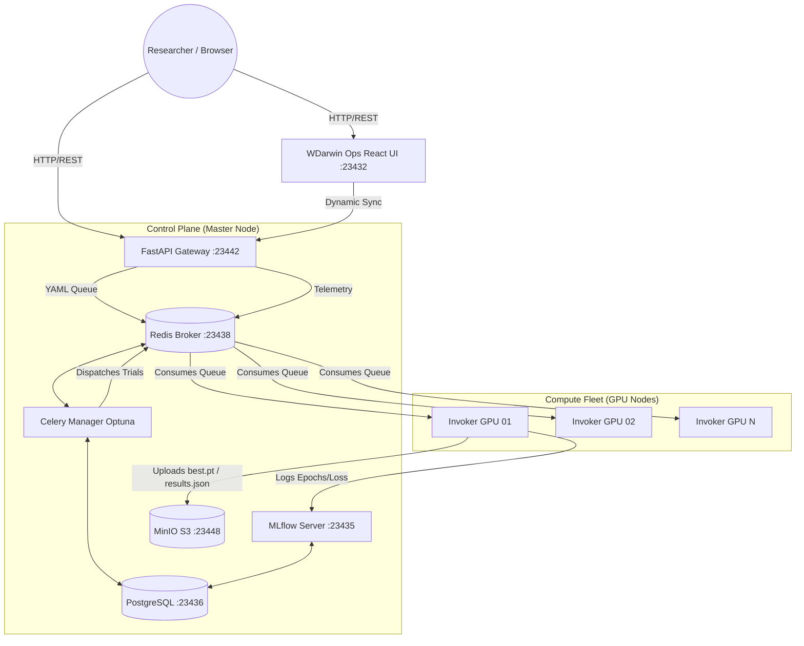

# 🧠 NeuralForgeAI & WDarwin Ops - User & Production Deployment Guide


**NeuralForgeAI** (and its control panel **WDarwin Ops**) is an enterprise-grade platform designed for **distributed orchestration, scalable training, and evolutionary hyperparameter optimization (Genetic Algorithms)** targeting advanced computer vision architectures, specifically **YOLOv8**, **YOLOv11**, and **YOLO26**.

The core objective of this system is to decouple the user interface layer from the heavy-compute layer. It enables researchers and developers to submit simple YAML configurations to a centralized cluster. The cluster autonomously handles load balancing, priority assignment, model evolution (mutations through genetic algorithms), and structured metric logging.

---

## 🛠️ Tech Stack

The project is built upon a robust, high-performance infrastructure:

### Frontend (UI)
*   **Core:** React 19, TypeScript
*   **Build System:** Vite, Node.js (18-alpine)
*   **Styling:** Tailwind CSS (v3.4, Native PostCSS)
*   **Icons:** Lucide React (Flame, Activity, Rocket, etc.)

### Backend (API & Orchestration)
*   **API Gateway:** FastAPI, Python 3.10, Uvicorn (RESTful Endpoints)
*   **Task Queue:** Celery
*   **Hyperparameter Optimization:** Optuna (evolutionary algorithms, TPESampler)
*   **System Telemetry:** `psutil` (real-time hardware monitoring)

### Infrastructure & Data
*   **Message Broker / State:** Redis
*   **Relational Database:** PostgreSQL (to house Optuna studies on port `23436`)
*   **Artifacts Storage:** MinIO (S3-Compatible on port `23448`)
*   **Experiment Tracking:** MLflow (port `23435`)
*   **Deployment & Resilience:** Docker Compose, Systemd (Watchdog services), Watchtower (auto-updates)

---

## 🧩 Project Components (Microservices)

The ecosystem is divided into 5 specialized repositories that interact asynchronously:

| Microservice | Local Directory | Description & Purpose |
| :--- | :--- | :--- |
| **Production Hub** | `wyoloservice2_production` | **(This repository)** The main entry point. Contains the Master node Docker Compose stacks, cluster topology, and worker GPU node setup files. |
| **Control Server (Master Host)** | `wyoloservice2_control_server` | Deploys the shared data foundation: Redis (queues), PostgreSQL (Optuna DB), MinIO (weights and datasets), and MLflow (quantitative metrics). |
| **API Gateway & UI** | `NeuralForgeAI` | Houses both the FastAPI server (`/api` on port `23442`) and the WDarwin Ops React panel (`/UI` on port `23432`) syncing the live cluster state. |
| **Study Manager** | `wyoloservice2_manager` | Celery consumer. Listens to the `managers` queue, parses YAML search spaces, creates Optuna studies/trials, computes fitness, and orchestrates genetic mutations. |
| **Worker Invoker (GPU Nodes)** | `wyoloservice2_invoker` | Heavy-execution GPU worker. Downloads datasets, mounts Samba shares, spawns ephemeral YOLO training docker containers, validates metrics, and uploads results. |

---

## 🗺️ System Architecture



---

## 🚀 Installation & Deployment Guide

### Prerequisites
*   Docker and Docker Compose v2.
*   NVIDIA Drivers and `nvidia-container-toolkit` installed on GPU nodes.
*   Network access between GPU Workers and the Master Host (exposed ports for PostgreSQL, Redis, FastAPI, MLflow, and MinIO).

### Step 1: Master Node Installation (Control Plane)
1. Navigate to the control server production directory:
   ```bash
   cd wyoloservice2_production/control_server
   ```
2. Configure the environment variables in `control_host.env` (assign the master's IP, database credentials, and S3 access keys).
3. Start all services using the unified Makefile:
   ```bash
   make start_all
   ```
   *This command creates the `control_network`, starts Redis/Postgres/MinIO/MLflow (`make start_env`), compiles and runs the FastAPI API & Frontend (`make start_api`), and boots the Celery Optuna manager (`make start_manager`).*

### Step 2: Compute Nodes Installation (GPU Workers)
On every machine equipped with an NVIDIA GPU, execute the automated Invoker installation:
```bash
curl -o download.sh https://raw.githubusercontent.com/wisrovi/wyoloservice2_production/refs/heads/main/workers/download.sh && sh download.sh && cd wyolo_worker_setup && sudo ./install.sh
```
**What does this script do?**
1. Sets up the `wyolo_worker.service` daemon (an indestructible Systemd Watchdog that restarts the worker immediately upon failures).
2. Configures **Watchtower**, which runs in the background and checks every 10 minutes for newly built images on Docker Hub to update them without cluster interruption.
3. Sets up CIFS (Samba) mounts at `/wyolo/control_server` and `/wyolo/worker` to allow fast read/write access to configurations and datasets.

---

## 📖 User Guide & Operations

### 1. Interacting via the Web UI (WDarwin Ops)
*   Access the UI via your browser: `http://<MASTER_IP>:23432`.
*   **Core Panels:**
    *   **Cluster Telemetry:** Live monitoring of CPU/GPU load, RAM usage, and disk space on active nodes.
    *   **Training Launcher:** Drag-and-drop YAML config uploader.
    *   **Study History:** Search, filter, and drill down into active/completed trials.
*   **Integrated Smoke Tests (Admin Only):**
    *   **Basic Smoke Test (⚡ Activity Icon):** Launches a dry-run study (`dry_run: true`) with 5 trials to verify complete Celery, Redis, API, and Invoker connectivity.
    *   **Advanced E2E Smoke Test (🔥 Flame Icon):** Launches three concurrent real GPU training runs (Classification, Detection, and Segmentation) using `yolo26` configurations to validate S3 artifact writes and MLflow tracking.

### 2. Interacting via the REST API

#### Submit a Training Study:
Send a `POST` request to the `/train` endpoint with your YAML configuration:
```bash
curl -X POST "http://<MASTER_IP>:23442/train" \
  -F "config_file=@my_experiment.yaml" \
  -F "mode=public" \
  -F "priority=medium"
```
*Response:* `{"status": "success", "study_id": "STUDY-UUID", "routing": "managers"}`

#### Retrieve Study Progress:
```bash
curl -X GET "http://<MASTER_IP>:23442/study/STUDY-UUID"
```

#### Gracefully Cancel an Active Study:
```bash
curl -X POST "http://<MASTER_IP>:23442/study/STUDY-UUID/cancel"
```

---

## ⚙️ Config Template (`base_config.yaml`)

```yaml
model: "yolo26n.pt"         # Base architecture (yolo26n.pt, yolo26n-cls.pt, yolo26n-seg.pt)
type: "yolo"                # Framework type
train:
  batch: -1                 # Autotune batch size
  data: "/examples/Deteksi komponen elektronik.v1i.yolov8/data.yaml" # Absolute dataset path
  epochs: 5                 # Epoch count
  imgsz: 640                # Image resolution
  plots: true               # Generate curves and confusion matrix
sweeper:
  version: 1
  algorithm: optuna
  direction: maximize       # Optimize direction for target metric
  study_name: "example_experiment"
  fitness: "metrics/mAP50"  # Target metric to optimize
  tune: true                # Enable parameter tuning search
  sampler: "TPESampler"
  n_trials: 10              # Number of trials (mutations)
  search_space:
    train:
      lr0: [ "loguniform", 1e-5, 1e-2 ]
      momentum: [ "uniform", 0.8, 0.99 ]
extras:
  gpu:
    id: 0
    limit: 0.95             # GPU load limit allocation
metadata:
  content: "Distributed optimization test"
  author: "William Rodriguez"
  documentation: "Evaluating YOLO26 detection performance."
```

---

## 🤖 Model Context Protocol (MCP) Integration

The **Model Context Protocol (MCP)** enables intelligent LLM agents (such as Claude Desktop, Antigravity, or Cursor) to act as autonomous operators on the NeuralForgeAI cluster.

### MCP Integration Diagram

```
┌──────────────┐             ┌────────────┐             ┌────────────────┐
│  LLM Agent   │ ──────────> │ MCP Client │ ──────────> │   MCP Server   │
│  (AI Coder)  │             │  (Claude)  │             │ (Postgres/API) │
└──────────────┘             └────────────┘             └────────────────┘
                                                                │
                                                                ▼
                                                        ┌────────────────┐
                                                        │ NeuralForgeAI  │
                                                        │   Cluster      │
                                                        └────────────────┘
```

### Configuring MCP Servers in Your Client

To allow your AI assistant to query studies directly from PostgreSQL, submit training jobs, or inspect system files, add the following servers to your client configuration file (e.g., `~/.config/Claude/claude_desktop_config.json`):

```json
{
  "mcpServers": {
    "neuralforge-database": {
      "command": "npx",
      "args": [
        "-y",
        "@modelcontextprotocol/server-postgres",
        "postgresql://postgres:postgres@<MASTER_IP>:23436/wyoloservice"
      ]
    },
    "neuralforge-filesystem": {
      "command": "npx",
      "args": [
        "-y",
        "@modelcontextprotocol/server-filesystem",
        "/home/wisrovi/Documents/train_service_2/wyoloservice2_production"
      ]
    }
  }
}
```

### AI Agent Capabilities via MCP:
1. **Direct Database Queries (`neuralforge-database`):** The LLM can write SQL queries to list studies, inspect the best trial parameters, track trials loss metrics, or analyze execution failures directly.
2. **File System Operations (`neuralforge-filesystem`):** Allows the AI agent to edit/create YAML files, read error logs, or inspect configurations on the master host.
3. **Gateway REST Calls:** If equipped with HTTP clients, the agent can issue `POST /train` requests, monitor status, and programmatically cancel training studies based on real-time metric analysis.

---

## 👨‍💻 Author

**William Steve Rodriguez Villamizar (wisrovi)**  
*AI Leader & Solutions Architect*  
*   [LinkedIn Profile](https://www.linkedin.com/in/wisrovi-rodriguez/)

> *"Decoupling complex AI research and transforming it into distributed, scalable industrial applications."*
