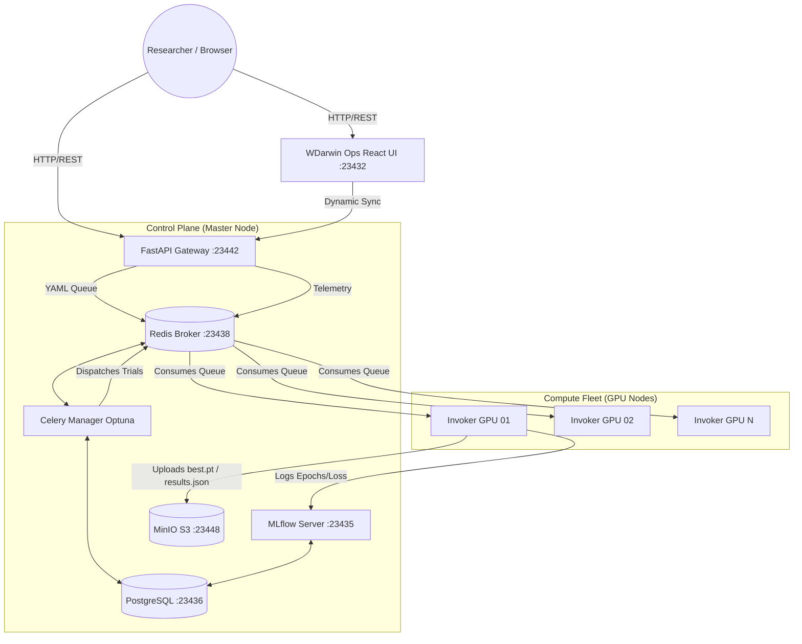

# 🧠 NeuralForgeAI & WDarwin Ops - User & Production Deployment Guide


**NeuralForgeAI** (and its control panel **WDarwin Ops**) is an enterprise-grade platform designed for **distributed orchestration, scalable training, and evolutionary hyperparameter optimization (Genetic Algorithms)** targeting advanced computer vision architectures, specifically **YOLOv8**, **YOLOv11**, and **YOLO26**.

The core objective of this system is to decouple the user interface layer from the heavy-compute layer. It enables researchers and developers to submit simple YAML configurations to a centralized cluster. The cluster autonomously handles load balancing, priority assignment, model evolution (mutations through genetic algorithms), and structured metric logging.

---

## 🛠️ Tech Stack

The project is built upon a robust, high-performance infrastructure:

### Frontend (UI)
*   **Core:** React 19, TypeScript
*   **Build System:** Vite, Node.js (18-alpine)
*   **Styling:** Tailwind CSS (v3.4, Native PostCSS)
*   **Icons:** Lucide React (Flame, Activity, Rocket, etc.)

### Backend (API & Orchestration)
*   **API Gateway:** FastAPI, Python 3.10, Uvicorn (RESTful Endpoints)
*   **Task Queue:** Celery
*   **Hyperparameter Optimization:** Optuna (evolutionary algorithms, TPESampler)
*   **System Telemetry:** `psutil` (real-time hardware monitoring)

### Infrastructure & Data
*   **Message Broker / State:** Redis
*   **Relational Database:** PostgreSQL (to house Optuna studies on port `23436`)
*   **Artifacts Storage:** MinIO (S3-Compatible on port `23448`)
*   **Experiment Tracking:** MLflow (port `23435`)
*   **Deployment & Resilience:** Docker Compose, Systemd (Watchdog services), Watchtower (auto-updates)

---

## 🧩 Project Components (Ecosystem Repositories)

The NeuralForgeAI ecosystem is composed of 7 sibling repositories, orchestrating different layers of the distributed workflow:

| Repository / Component | Local Directory | GitHub Link | Description & Purpose |
| :--- | :--- | :--- | :--- |
| **Production Hub** | `wyoloservice2_production` | [wisrovi/wyoloservice2_production](https://github.com/wisrovi/wyoloservice2_production) | **(This repository)** Master deployment files, unified Makefiles, Samba credentials, and node setup scripts. |
| **Control Server** | `wyoloservice2_control_server` | [wisrovi/wyoloservice2_control_server](https://github.com/wisrovi/wyoloservice2_control_server) | Master data foundation stack, housing Redis, PostgreSQL (Optuna DB), MinIO (S3 storage), and MLflow. |
| **API Gateway & UI** | `NeuralForgeAI` | [wisrovi/NeuralForgeAI](https://github.com/wisrovi/NeuralForgeAI) | Houses the REST API Gateway (FastAPI on port `23442`) and the WDarwin Ops Single Page App dashboard (React on port `23432`). |
| **Study Manager** | `wyoloservice2_manager` | [wisrovi/wyoloservice2_manager](https://github.com/wisrovi/wyoloservice2_manager) | Celery study manager executing the Optuna genetic hyperparameter optimization trials loop. |
| **Worker Invoker** | `wyoloservice2_invoker` | [wisrovi/wyoloservice2_invoker](https://github.com/wisrovi/wyoloservice2_invoker) | GPU-node background daemon consuming Redis tasks queue and launching executor containers. |
| **YOLO Training Worker** | `wyoloservice2_worker` | [wisrovi/wyoloservice2_worker](https://github.com/wisrovi/wyoloservice2_worker) | Ephemeral YOLO container codebase (`wtrain`) performing real dataset validation and model training on GPUs. |
| **Model Context Protocol** | `wyoloservice2_mcp` | [wisrovi/wyoloservice2_mcp](https://github.com/wisrovi/wyoloservice2_mcp) | FastMCP server exposing tools to LLMs (Claude, Antigravity) for automated, natural-language cluster control. |

---

## 🗺️ System Architecture



---

## 📦 MinIO S3 Bucket & Artifacts Structure

All training runs automatically stream weights, metrics, and configurations to the MinIO object storage. The files are organized within the `mlflow-artifacts` bucket under the following prefix tree:

```
mlflow-artifacts/
└── <experiment_id>/              # Optuna study database ID (e.g. 2, 3, 4)
    └── <run_uuid>/               # Unique MLflow Run ID
        ├── artifacts/            # Output assets folder
        │   ├── results.json      # Final accuracy metric file, e.g. {"accuracy": 0.7059}
        │   ├── model_weights/    # Contains PyTorch trained weights
        │   │   ├── best.pt       # Best epoch weights checkpoint
        │   │   └── last.pt       # Last epoch weights checkpoint
        │   ├── evaluation_metrics/ # Performance graphs
        │   │   ├── F1_curve.png
        │   │   ├── PR_curve.png
        │   │   ├── confusion_matrix.png
        │   │   └── results.csv
        │   └── training_artifacts/ # Run config copies
        │       ├── base_config.yaml
        │       └── data.yaml
        ├── meta.yaml             # MLflow run metadata
        └── metrics/              # Live streamed metrics history
```

---

## ⛓️ Celery Priority Queues & Task Routing

The clúster balances manager studies and GPU task executions dynamically across multiple queues in Redis. When submitting a study via the API/UI, Celery routes tasks based on priority flags:

### 1. Management Queue (`managers`)
All initial configuration parsing and Optuna genetic loops run in the `managers` queue. The **Celery Study Manager** consumes this queue to schedule trial runs.

### 2. GPU Task Queues (`gpus_high`, `gpus_medium`, `gpus_low`)
When the Celery Manager generates a trial mutation, it routes the execution payload to the workers based on the study priority:
* **`priority: high`:** Routed to the `gpus_high` queue. Consumed first by available worker-invokers.
* **`priority: medium`:** Routed to the `gpus_medium` queue. Consumed when the high-priority queue is empty.
* **`priority: low`:** Routed to the `gpus_low` queue. Ideal for background or overnight sweeps (e.g. Smoke Tests run on `low`).

### 3. Worker Concurrency Settings
Worker-invoker nodes pull tasks using a concurrency cap to prevent out-of-memory errors on shared GPUs. Each worker daemon is configured by default with `--concurrency=1` to ensure strict single-GPU allocation per trial, though this can be scaled up on multi-GPU machines.

---

## 🚀 Installation & Deployment Guide

### Prerequisites
*   Docker and Docker Compose v2.
*   NVIDIA Drivers and `nvidia-container-toolkit` installed on GPU nodes.
*   Network access between GPU Workers and the Master Host (exposed ports for PostgreSQL, Redis, FastAPI, MLflow, and MinIO).

### Step 1: Master Node Installation (Control Plane)
1. Navigate to the control server production directory:
   ```bash
   cd wyoloservice2_production/control_server
   ```
2. Configure the environment variables in `control_host.env` (assign the master's IP, database credentials, and S3 access keys).
3. Start all services using the unified Makefile:
   ```bash
   make start_all
   ```
   *This command creates the `control_network`, starts Redis/Postgres/MinIO/MLflow (`make start_env`), compiles and runs the FastAPI API & Frontend (`make start_api`), and boots the Celery Optuna manager (`make start_manager`).*

### Step 2: Compute Nodes Installation (GPU Workers)
On every machine equipped with an NVIDIA GPU, execute the automated Invoker installation:
```bash
curl -o download.sh https://raw.githubusercontent.com/wisrovi/wyoloservice2_production/refs/heads/main/workers/download.sh && sh download.sh && cd wyolo_worker_setup && sudo ./install.sh
```
**What does this script do?**
1. Sets up the `wyolo_worker.service` daemon (an indestructible Systemd Watchdog that restarts the worker immediately upon failures).
2. Configures **Watchtower**, which runs in the background and checks every 10 minutes for newly built images on Docker Hub to update them without cluster interruption.
3. Sets up CIFS (Samba) mounts at `/wyolo/control_server` and `/wyolo/worker` to allow fast read/write access to configurations and datasets.

### Step 3: Quick Local Validation (Micro Train Tests)

Once a worker node is installed, you can perform quick, direct training validation checks on the GPU using the 3 example datasets. The purpose of these tests is to verify the correct local execution of the pipeline (verifying GPU driver compatibility, dataset path accessibility over Samba CIFS mount, S3 MinIO storage uploads, and MLflow logging) without submitting Celery tasks.

Upon successful completion of the tests:
- The trained models, S3 artifacts (`best.pt`, confusion matrices, evaluation curves), and a raw metrics results file `results.json` are written to the master MinIO storage.
- Real-time quantitative training statistics can be observed in the **MLflow Dashboard** (`http://<MASTER_IP>:23435`).

Download the validation script and run the respective test commands:

```bash
# Download and prepare the micro train script
wget https://raw.githubusercontent.com/wisrovi/wyoloservice2_production/refs/heads/main/workers/micro_train.sh
chmod +x micro_train.sh

# Test 1: Color Ball Image Classification
# Purpose: Validates classification pipeline. Results are logged in MLflow under study name "color_ball_classification" (Experiment 2).
./micro_train.sh --config /examples/colorball.v8i.multiclass/base_config.yaml --gpu 80 --cpu 12 --ram 40 --shm 24

# Test 2: Electronics Component Object Detection
# Purpose: Validates bounding box detection pipeline. Results are logged in MLflow under study name "component_detection" (Experiment 3).
./micro_train.sh --config "/examples/Deteksi komponen elektronik.v1i.yolov8/base_config.yaml" --gpu 80 --cpu 12 --ram 40 --shm 24

# Test 3: Architectural Floor Plan Instance Segmentation
# Purpose: Validates polygon instance segmentation pipeline. Results are logged in MLflow under study name "architecture_segmentation" (Experiment 4).
./micro_train.sh --config /examples/ArchitecturePlan/base_config.yaml --gpu 80 --cpu 12 --ram 40 --shm 24
```

---

## 📖 User Guide & Operations

### 1. Interacting via the Web UI (WDarwin Ops)
*   Access the UI via your browser: `http://<MASTER_IP>:23432`.
*   **Core Panels:**
    *   **Cluster Telemetry:** Live monitoring of CPU/GPU load, RAM usage, and disk space on active nodes.
    *   **Training Launcher:** Drag-and-drop YAML config uploader.
    *   **Study History:** Search, filter, and drill down into active/completed trials.
*   **Integrated Smoke Tests (Admin Only):**
    *   **Basic Smoke Test (⚡ Activity Icon):** Launches a dry-run study (`dry_run: true`) with 5 trials to verify complete Celery, Redis, API, and Invoker connectivity.
    *   **Advanced E2E Smoke Test (🔥 Flame Icon):** Launches three concurrent real GPU training runs (Classification, Detection, and Segmentation) using `yolo26` configurations to validate S3 artifact writes and MLflow tracking.

### 2. Interacting via the REST API

#### Submit a Training Study:
Send a `POST` request to the `/train` endpoint with your YAML configuration:
```bash
curl -X POST "http://<MASTER_IP>:23442/train" \
  -F "config_file=@my_experiment.yaml" \
  -F "mode=public" \
  -F "priority=medium"
```
*Response:* `{"status": "success", "study_id": "STUDY-UUID", "routing": "managers"}`

#### Retrieve Study Progress:
```bash
curl -X GET "http://<MASTER_IP>:23442/study/STUDY-UUID"
```

#### Gracefully Cancel an Active Study:
```bash
curl -X POST "http://<MASTER_IP>:23442/study/STUDY-UUID/cancel"
```

### 3. Visualizing Studies with Optuna Dashboard

Optuna stores hyperparameter trials data inside the PostgreSQL database. Researchers can start the visual **Optuna Dashboard** to analyze optimization graphs, parameters importance, and trials history:

```bash
# Install the Optuna Dashboard package
pip install optuna-dashboard

# Start the dashboard pointing to the PostgreSQL container port 23436
optuna-dashboard postgresql://postgres:postgres@<MASTER_IP>:23436/wyoloservice --port 23437
```
Once started, navigate to `http://<MASTER_IP>:23437` to interact with optimization plots.

---

## ⚙️ Config Template (`base_config.yaml`)

```yaml
model: "yolo26n.pt"         # Base architecture (yolo26n.pt, yolo26n-cls.pt, yolo26n-seg.pt)
type: "yolo"                # Framework type
train:
  batch: -1                 # Autotune batch size
  data: "/examples/Deteksi komponen elektronik.v1i.yolov8/data.yaml" # Absolute dataset path
  epochs: 5                 # Epoch count
  imgsz: 640                # Image resolution
  plots: true               # Generate curves and confusion matrix
sweeper:
  version: 1
  algorithm: optuna
  direction: maximize       # Optimize direction for target metric
  study_name: "example_experiment"
  fitness: "metrics/mAP50"  # Target metric to optimize
  tune: false                # Not Enable parameter tuning search
  sampler: "TPESampler"
  n_trials: 10              # Number of trials (mutations)
  search_space:
    train:
      lr0: [ "loguniform", 1e-5, 1e-2 ]
      momentum: [ "uniform", 0.8, 0.99 ]
extras:
  gpu:
    id: 0
    limit: 0.95             # GPU load limit allocation
metadata:
  content: "Distributed optimization test"
  author: "William Rodriguez"
  documentation: "Evaluating YOLO26 detection performance."
```

---

## 🎛️ Advanced Optuna Sweeper Tuning Guide

The clúster's Optuna Manager parses the `sweeper` block in the YAML file to build dynamic search spaces for Genetic Algorithms and hyperparameter mutation loops. Below is the configuration syntax for customizing tuning strategies.

### 1. Optimization Directions
* **`direction: maximize`** (Default): Use for metrics where higher values are better, such as `metrics/accuracy_top1` or `metrics/mAP50`.
* **`direction: minimize`**: Use for loss values, such as `val/box_loss` or `val/cls_loss`.

### 2. Available Samplers (`sweeper.sampler`)
* **`TPESampler`** (Recommended): Tree-structured Parzen Estimator. Fits a probability model to history and selects parameters likely to maximize fitness.
* **`RandomSampler`**: Selects random hyperparameter combinations. Good for uniform initial sweeps.
* **`GridSampler`**: Exclusively sweeps discrete choices defined in the search space.

### 3. Hyperparameter Bounds & Types (`search_space`)
Define bounds inside `sweeper.search_space.train` or `sweeper.search_space.model` to control parameter sampling types:

* **Categorical / Choices (Discrete)**
  Samples from a defined list of values.
  ```yaml
  model: ["choice", "yolov8n.pt", "yolov8s.pt", "yolov8m.pt"]
  train:
    imgsz: ["choice", 416, 512, 640]
  ```
* **Uniform Float (Continuous)**
  Samples float values uniformly between a minimum and maximum bound.
  ```yaml
  train:
    momentum: ["uniform", 0.8, 0.99]
  ```
* **Log-Uniform Float (Continuous Exponential)**
  Samples float values exponentially. Essential for learning rates (`lr0`, `lrf`) and weight decays.
  ```yaml
  train:
    lr0: ["loguniform", 1e-5, 1e-2]
  ```
* **Uniform Integer (Discrete Range)**
  Samples integer numbers between bounds.
  ```yaml
  train:
    epochs: ["int", 50, 200]
  ```

---

## 🤖 Model Context Protocol (MCP) Integration (`wyoloservice-mcp`)

The ecosystem provides a native Model Context Protocol (MCP) server named `wyoloservice-mcp` (repository: `wyoloservice2_mcp`). This server enables LLM agents (like Claude Desktop, Antigravity, or Cursor) to act as autonomous operators on your cluster—validating remote paths, compiling configs, launching studies, and tracking metrics.

### MCP Integration Architecture

```
┌────────────────┐           ┌──────────────┐           ┌───────────────────┐
│   LLM Agent    │ ────────> │  MCP Client  │ ────────> │  wyoloservice-mcp  │
│ (AI Assistant) │           │ (Claude/agy) │           │ (FastMCP Server)  │
└────────────────┘           └──────────────┘           └───────────────────┘
                                                                  │
                                      ┌───────────────────────────┴───────────────────────────┐
                                      ▼                                                       ▼
                            ┌───────────────────┐                                   ┌───────────────────┐
                            │ REST API Gateway  │                                   │ Docker Exec (GPU) │
                            │ (POST /train etc) │                                   │ (Mounts CIFS E2E) │
                            └───────────────────┘                                   └───────────────────┘
```

### Installation

The MCP package is published on PyPI and can be installed globally:

```bash
# Install from PyPI
pip install wyoloservice-mcp

# Or install from local source
cd /home/wisrovi/Documents/train_service_2/wyoloservice2_mcp
pip install -e .
```
This registers the command `wyolo-mcp` in the shell environment.

### Registering the MCP Server in LLM Clients

To connect the server, configure the `wyolo-mcp` command in your client settings.

#### For Antigravity (Gemini CLI)
Add the server under `~/.gemini/config/mcp.json`:
```json
{
  "mcpServers": {
    "neuralforge-mcp": {
      "command": "wyolo-mcp"
    }
  }
}
```

#### For Claude Desktop
Add the server under `~/.config/Claude/claude_desktop_config.json` (Linux):
```json
{
  "mcpServers": {
    "neuralforge-mcp": {
      "command": "wyolo-mcp"
    }
  }
}
```

#### For Cursor IDE
Add it in `Settings > Features > MCP` as an `stdio` server using the command `wyolo-mcp`.

---

### Expose Tools (Agentic Capabilities)

Once active, the agent gains access to the following programmatic tools:

| MCP Tool | Description |
| :--- | :--- |
| `set_cluster_credentials(ip, cifs_user, cifs_pass)` | Configures host connection details and stores them in `~/.wyolo_mcp_config.json`. |
| `get_cluster_status()` | Fetches API Gateway health, Celery workers status, and Celery queues telemetry in parallel. |
| `check_dataset_path(dataset_path)` | Spawns a dockerized check to confirm the existence of a dataset path on the Samba CIFS share. |
| `validate_dataset_advanced(dataset_path, task)` | Spawns a validation container to parse YAML contents, check paths, and inspect dataset folder integrity. |
| `generate_training_yaml(config, output_dir)` | Compiles and saves a standardized "Sweeper v2" configuration YAML. |
| `launch_training(yaml_path)` | Uploads the YAML config file to the REST API and automatically updates the local YAML with the study ID. |
| `get_study_details(study_id)` | Polls trial statistics, active metrics (e.g. accuracy), and GPU worker details. |
| `cancel_study(study_id)` | Sends a cancellation query to Celery to terminate active training. |

### Smart Agentic Workflows
The MCP tools contain built-in system instructions embedded in their docstrings to enforce agentic practices:
* **Automatic credential recovery:** Once configured, the agent retrieves keys from the configuration store without prompting the user.
* **Intelligent study tracing:** When asked "how is my training going?", the agent will inspect the current directory, locate generated `.yaml` files, extract the `study_id`, and pull metrics from the cluster automatically.

## 📂 Repository Directory Tree

The directory layout of `wyoloservice2_production` is structured as follows:

```
wyoloservice2_production/
├── control_server/              # Master Node Infrastructure
│   ├── docker-compose.api.yml   # Gateway API (FastAPI) compose file
│   ├── docker-compose.env.yml   # Core Datastore (Postgres, Redis, MinIO, MLflow)
│   ├── docker-compose.manager.yml # Optuna Sweeper Manager Celery worker
│   ├── control_host.env         # Master variables environment template
│   └── Makefile                 # Master stack startup automation commands
├── workers/                     # GPU Compute Node Scripts
│   ├── download.sh              # 1-click Worker package downloader
│   ├── install.sh               # Watchdog systemd & Watchtower setup script
│   └── micro_train.sh           # Ephemeral docker image validation check
└── docs/                        # Sphinx documentation builds
```

---

## 🔌 Services & Ports Quick Reference

Below is a quick reference mapping of the cluster ports exposed on the Master Node (`<MASTER_IP>`):

| Service | Port | Protocol / API | Access Method |
| :--- | :---: | :--- | :--- |
| **WDarwin Ops (UI)** | `23432` | HTTP / React SPA | `http://<MASTER_IP>:23432` |
| **FastAPI Gateway (API)** | `23442` | HTTP / REST API | `http://<MASTER_IP>:23442/health` |
| **MLflow Server** | `23435` | HTTP / Experiments | `http://<MASTER_IP>:23435` |
| **PostgreSQL Database** | `23436` | TCP / Optuna Backend | `postgresql://postgres:postgres@<MASTER_IP>:23436/wyoloservice` |
| **Optuna Dashboard** | `23437` | HTTP / Optimization UI | `http://<MASTER_IP>:23437` |
| **Redis Broker** | `23438` | TCP / Celery Queues | `redis://<MASTER_IP>:23438/0` |
| **MinIO Console** | `23448` | HTTP / Storage UI | `http://<MASTER_IP>:23448` |
| **MinIO S3 Endpoint** | `23449` | HTTP / S3 API | `http://<MASTER_IP>:23449` |

---

## 📊 Logs & Telemetry Commands

To inspect the system's live behavior, execute the following commands on the Master Node:

### 1. Inspect Master Services Logs (VDarwin Ops & API Gateway)
```bash
cd wyoloservice2_production/control_server

# View live FastAPI backend logs
docker compose -f docker-compose.api.yml --env-file control_host.env logs -f api

# View live React Frontend logs
docker compose -f docker-compose.api.yml --env-file control_host.env logs -f ui
```

### 2. Inspect Optuna Celery Manager Logs
```bash
docker compose -f docker-compose.manager.yml --env-file control_host.env logs -f manager
```

### 3. Check GPU Workers Logs (On Worker Nodes)
```bash
# View watchdog systemd logs
journalctl -u wyolo_worker.service -f -n 100
```

---

## 🔍 Troubleshooting & Maintenance

### 1. Postgres DB Connection Failures
* **Symptom:** API logs show `psycopg2.OperationalError: connection to server at "<MASTER_IP>", port 23436 failed: Connection refused`.
* **Fix:** Ensure PostgreSQL is running by calling `docker ps`. Verify that the database connection port `23436` is mapped on the host. If necessary, restart the master environment: `make stop_env && make start_env`.

### 2. Samba CIFS Write Permissions Check
* **Symptom:** Worker initialization fails with `CIFS mount touch test: Failed. Write permissions denied.`.
* **Fix:** The worker tests permissions by writing a temporary `.mount_test` file. Make sure the credentials in `/etc/cifs-credentials` are correct and that the Samba share owner has active write permissions (`chmod -R 775`).

### 3. Celery Task Jam / Redis Timeout
* **Symptom:** Submitted studies are stuck in `PENDING` state and Celery workers do not consume jobs.
* **Fix:** Restart Redis and clear stuck Celery queues:
  ```bash
  # Prune Redis keys & restart Celery queue
  redis-cli -p 23438 FLUSHALL
  docker restart control_server-fastapi-1 control_server-manager-1
  ```

### 4. Database Backup & Study Migrations
To migrate Optuna study databases between servers or back up metadata before system upgrades, run the following commands on the Master Node:

* **Export Study Database (Backup):**
  ```bash
  # Dump PostgreSQL data to local SQL file
  docker exec -t control_server-postgres-1 pg_dump -U postgres wyoloservice > wyoloservice_backup.sql
  ```

* **Import Study Database (Restore):**
  ```bash
  # Restore SQL backup file to active PostgreSQL container
  cat wyoloservice_backup.sql | docker exec -i control_server-postgres-1 psql -U postgres -d wyoloservice
  ```

---

## 🔒 Security & Samba Network Hardening

To protect credentials, dataset integrity, and container boundaries inside the cluster, enforce the following security best practices.

### 1. Samba CIFS Credentials Hardening
Never hardcode plain text passwords in fstab or mount scripts. Instead, use a credentials file restricted to root:

```bash
# Create the secure credentials file
sudo nano /etc/cifs-credentials

# Add the following properties:
username=wisrovi
password=wyoloservice

# Restrict permissions so only root can read or write
sudo chmod 600 /etc/cifs-credentials
sudo chown root:root /etc/cifs-credentials
```

### 2. Docker Container Security Constraints
When workers spin up training docker instances (`worker_executor`), limit container privileges to prevent escaping:
* **Privileged Flag Mitigation:** Avoid running worker containers with `--privileged` unless required for specific CIFS kernel mounts. Instead, mount files on the host and share directories via read-only volumes (`:ro`):
  ```bash
  # Example read-only dataset mount
  docker run -v /wyolo/control_server/datasets:/datasets:ro ...
  ```
* **User Isolation:** Run the training python processes inside the container under a non-root group and user (UID 1000) whenever possible to prevent host directory ownership hijacking.

### 3. PostgreSQL Database Access Control
Do not expose database port `23436` to the public internet. Restrict access using the host firewall (`iptables` or `ufw`) to only accept connections from your trusted cluster master and celery worker IPs:
```bash
# Allow Master Node local loopback and API Gateway
sudo ufw allow from 127.0.0.1 to any port 23436 proto tcp

# Allow worker nodes to sync Optuna studies
sudo ufw allow from 192.168.10.0/24 to any port 23436 proto tcp
sudo ufw deny 23436/tcp
```

---

## 📊 Hardware Benchmarks & Performance Profiles

To assist researchers in resource planning, below is a performance baseline reference measured on typical cluster configurations (measured on an NVIDIA GTX 1650 Ti / RTX 3060 baseline):

### 1. Resource Footprint by Task Type (Base Image `YOLO26`)

| Task Type | Expected Peak RAM | Avg GPU VRAM | Image Resolution | Training Speed (Approx) |
| :--- | :---: | :---: | :---: | :---: |
| **Classification (`colorball`)** | ~8.1 GB | ~1.6 GB | `640x640` | ~1.0 ms preprocess, ~2.7 ms inference |
| **Object Detection (`Deteksi`)** | ~2.7 GB | ~1.6 GB | `640x640` | ~0.5 ms preprocess, ~10.9 ms inference |
| **Segmentation (`Architecture`)** | ~2.6 GB | ~0.7 GB | `640x640` | ~0.5 ms preprocess, ~32.1 ms inference |

### 2. Recommendations for Scalability
* **Shared Memory (`--shm`):** Always allocate at least `24GB` of shared memory for high-concurrency parameter sweeps. Standard docker containers defaults (`64MB`) will cause PyTorch multi-processing dataloaders to crash under heavy load.
* **Auto-Batch Size (`batch: -1`):** Using `-1` triggers YOLO's internal hardware-capacity estimation, auto-scaling the batch size to utilize up to 90% of available GPU VRAM without risking Out-Of-Memory (OOM) errors.

---

## 👥 Developer & Contribution Guidelines

We welcome contributions to extend the NeuralForgeAI clúster capabilities. To contribute new features, follow this workflow:

### 1. Development Commit Rules
To maintain clean and granular pull requests, all repository changes must follow the **Single-File Commit Rule**:
* Every modified or added file must be committed and pushed in a **separate, independent commit** (one unique commit per file).

### 2. Pushing New Worker Container Images
If you update the worker training scripts (`wtrain` under `wyoloservice2_worker`), rebuild and push the image to Docker Hub so that worker nodes auto-pull the updates:
```bash
# Tag and push the final worker image
docker build -t wisrovi/train_service:worker_executor_v1.0.0 -f Dockerfile .
docker push wisrovi/train_service:worker_executor_v1.0.0
```
*Note: GPU compute nodes running Watchtower will automatically detect the new image digest and hot-reload active workers within 10 minutes.*

### 3. Exposing New FastMCP Tools
To add new functionalities for AI Agents, edit the MCP server source code under `wyoloservice2_mcp/src/wyolo_mcp/server.py`. Define your tool using the `@mcp.tool()` decorator:
```python
@mcp.tool()
def my_custom_agent_tool(arg1: str) -> dict:
    """
    Detailed docstring describing what the tool does. Enforce strict prompts
    instructing the LLM when and how to call this tool.
    """
    return {"status": "success", "data": arg1}
```

---

## 👨‍💻 Author

**William Steve Rodriguez Villamizar (wisrovi)**  
*AI Leader & Solutions Architect*  
*   [LinkedIn Profile](https://www.linkedin.com/in/wisrovi-rodriguez/)

> *"Decoupling complex AI research and transforming it into distributed, scalable industrial applications."*
