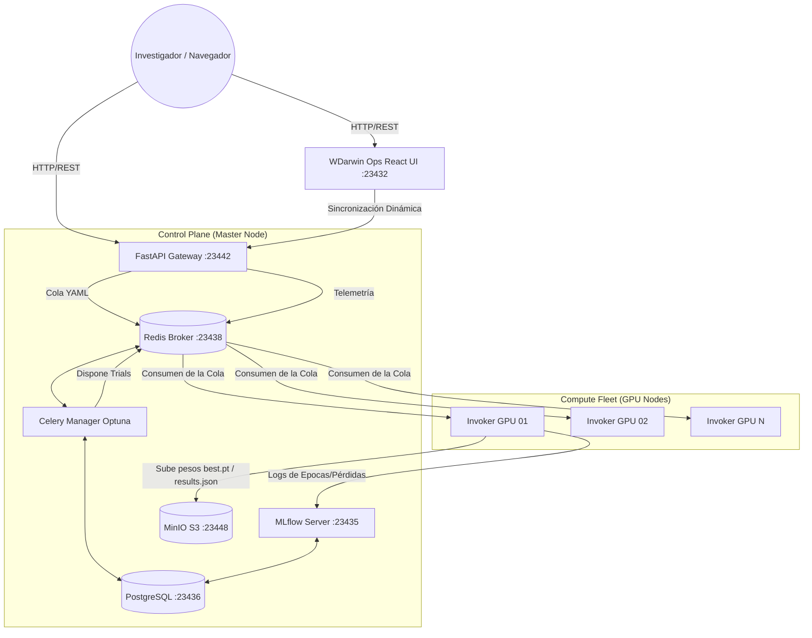

# 🧠 NeuralForgeAI & WDarwin Ops - Guía de Usuario y Ecosystem Hub


**NeuralForgeAI** (y su panel de control **WDarwin Ops**) es una plataforma de nivel empresarial diseñada para la **orquestación distribuida, entrenamiento escalable y optimización evolutiva de hiperparámetros (Algoritmos Genéticos)** orientada a arquitecturas avanzadas de visión artificial, específicamente **YOLOv8**, **YOLOv11** y **YOLO26**.

El objetivo central de este ecosistema es desacoplar por completo la capa de interfaz de usuario de la capa de cómputo pesado. Permite a investigadores y desarrolladores enviar configuraciones simples en formato YAML a un clúster centralizado, el cual se encarga de manera autónoma del balanceo de carga, asignación de prioridades, evolución de modelos (mutaciones a través de algoritmos evolutivos) y registro estructurado de métricas.

---

## 🛠️ Stack Tecnológico

El proyecto está construido sobre una infraestructura robusta y de alto rendimiento:

### Frontend (UI)
*   **Núcleo:** React 19, TypeScript
*   **Compilador:** Vite, Node.js (18-alpine)
*   **Estilos:** Tailwind CSS (v3.4, Native PostCSS)
*   **Iconos:** Lucide React (Flame, Activity, Rocket, etc.)

### Backend (API y Orquestación)
*   **Gateway API:** FastAPI, Python 3.10, Uvicorn (RESTful Endpoints)
*   **Cola de Tareas Distribuidas:** Celery
*   **Optimización de Hiperparámetros:** Optuna (algoritmos evolutivos, TPESampler)
*   **Telemetría del Clúster:** `psutil` (monitoreo de hardware en tiempo real)

### Infraestructura y Datos
*   **Broker de Mensajes / Estado:** Redis
*   **Base de Datos Relacional:** PostgreSQL (para albergar los estudios de Optuna en el puerto `23436`)
*   **Almacenamiento de Artefactos:** MinIO (S3-Compatible en el puerto `23448`)
*   **Seguimiento de Experimentos:** MLflow (puerto `23435`)
*   **Despliegue y Resiliencia:** Docker Compose, Systemd (servicios Watchdog), Watchtower (actualizaciones automáticas)

---

## 🧩 Partes del Proyecto (Microservicios)

El ecosistema está dividido en 5 repositorios especializados que interactúan de forma asíncrona:

| Microservicio | Ubicación Local | Descripción y Propósito |
| :--- | :--- | :--- |
| **Production Hub** | `wyoloservice2_production` | **(Este repositorio)** Punto de entrada principal. Contiene las pilas de Docker Compose del servidor maestro, los scripts de instalación de nodos GPU y la configuración de red global. |
| **Control Server (Máquina Master)** | `wyoloservice2_control_server` | Despliega los cimientos de datos compartidos: Redis (mensajería), PostgreSQL (estudios de Optuna), MinIO (pesos y datasets) y MLflow (métricas cuantitativas). |
| **API Gateway & UI** | `NeuralForgeAI` | Alberga el servidor FastAPI (`/api`, puerto `23442`) y el panel de control React (`/UI`, puerto `23432`) que sincroniza el estado en tiempo real. |
| **Study Manager** | `wyoloservice2_manager` | Consumidor Celery. Escucha la cola `managers`, lee el espacio de búsqueda del YAML, crea estudios y trials en Optuna, evalúa fitness y orquesta las mutaciones genéticas. |
| **Worker Invoker (Máquinas GPU)** | `wyoloservice2_invoker` | Ejecutor de tareas pesadas en las GPU de los nodos de cómputo. Descarga datos, monta Samba, lanza el contenedor efímero del worker YOLO, valida métricas y las reporta a S3 y MLflow. |

---

## 🗺️ Arquitectura del Sistema



---

## 🚀 Guía de Instalación

### Requisitos Previos
*   Docker y Docker Compose v2.
*   Drivers de NVIDIA y `nvidia-container-toolkit` instalado en los nodos GPU.
*   Acceso a red entre los nodos Workers y el nodo Maestro (puertos expuestos para PostgreSQL, Redis, FastAPI, MLflow y MinIO).

### Paso 1: Configuración e Instalación del Nodo Master (Control Plane)
1. Sitúate en el directorio de producción:
   ```bash
   cd wyoloservice2_production/control_server
   ```
2. Configura las variables de entorno en el archivo `control_host.env` (asigna la IP pública/local del maestro, credenciales de base de datos y llaves de acceso S3).
3. Levanta todos los servicios utilizando el Makefile unificado:
   ```bash
   make start_all
   ```
   *Esto creará la red `control_network`, iniciará Redis/PostgreSQL/MinIO/MLflow (`make start_env`), compilará y levantará la API y el Frontend (`make start_api`), e iniciará el administrador Celery de Optuna (`make start_manager`).*

### Paso 2: Configuración e Instalación de Nodos GPU (Workers)
En cada máquina de cómputo que posea una tarjeta gráfica NVIDIA, ejecuta la instalación automatizada del Invoker:
```bash
curl -o download.sh https://raw.githubusercontent.com/wisrovi/wyoloservice2_production/refs/heads/main/workers/download.sh && sh download.sh && cd wyolo_worker_setup && sudo ./install.sh
```
**¿Qué hace este script?**
1. Configura el daemon de sistema `wyolo_worker.service` (un Watchdog de Systemd indestructible que reinicia el worker inmediatamente si sufre caídas).
2. Configura **Watchtower**, que corre en segundo plano y comprueba cada 10 minutos si hay nuevas imágenes compiladas en Docker Hub para actualizarlas sin interrumpir el clúster.
3. Configura los montajes CIFS (Samba) en `/wyolo/control_server` y `/wyolo/worker` para permitir lectura/escritura veloz de configuraciones y datasets.

---

## 📖 Guía de Uso del Sistema

### 1. Interacción a través de la Interfaz Web (WDarwin Ops)
*   Accede mediante tu navegador al puerto expuesto de la UI: `http://<IP_MAESTRO>:23432`.
*   **Secciones principales:**
    *   **Monitoreo del Clúster:** Visualiza en tiempo real el uso de CPU/GPU, memoria y almacenamiento de los nodos conectados.
    *   **Lanzamiento de Entrenamientos:** Drag-and-drop de archivos YAML de configuración.
    *   **Historial de Estudios:** Búsqueda rápida de tareas, inspección de trials y estado de entrenamiento.
*   **Pruebas de Humo Integradas (Solo Administradores):**
    *   **Basic Smoke Test (Icono Actividad ⚡):** Ejecuta un entrenamiento simulado rápido (`dry_run: true`) de 5 trials para validar que el Invoker, Redis, la API y Celery se comunican perfectamente.
    *   **Advanced E2E Smoke Test (Icono Flama 🔥):** Lanza tres entrenamientos reales en paralelo (Clasificación, Detección y Segmentación) utilizando pesos `yolo26` en el GPU para validar la persistencia final en MinIO S3 y MLflow.

### 2. Interacción Directa con la API REST (Programática)

#### Lanzar un Estudio de Entrenamiento:
Envía una petición `POST` al endpoint `/train` subiendo tu archivo YAML:
```bash
curl -X POST "http://<IP_MAESTRO>:23442/train" \
  -F "config_file=@mi_experimento.yaml" \
  -F "mode=public" \
  -F "priority=medium"
```
*Retorna:* `{"status": "success", "study_id": "STUDY-UUID", "routing": "managers"}`

#### Consultar Progreso de un Estudio:
```bash
curl -X GET "http://<IP_MAESTRO>:23442/study/STUDY-UUID"
```

#### Cancelar de forma Graciosa un Estudio Activo:
```bash
curl -X POST "http://<IP_MAESTRO>:23442/study/STUDY-UUID/cancel"
```

---

## ⚙️ Plantilla Estructurada de Configuración (`base_config.yaml`)

```yaml
model: "yolo26n.pt"         # Arquitectura base (yolo26n.pt, yolo26n-cls.pt, yolo26n-seg.pt, etc.)
type: "yolo"                # Tipo de framework
train:
  batch: -1                 # Autotune batch size
  data: "/examples/Deteksi komponen elektronik.v1i.yolov8/data.yaml" # Ruta absoluta del dataset
  epochs: 5                 # Número de épocas
  imgsz: 640                # Resolución de imágenes
  plots: true               # Generar curvas de validación
sweeper:
  version: 1
  algorithm: optuna
  direction: maximize       # Optimizar para el fitness indicado
  study_name: "experimento_ejemplo"
  fitness: "metrics/mAP50"  # Métrica objetivo
  tune: true                # Activar búsqueda hiperparamétrica
  sampler: "TPESampler"
  n_trials: 10              # Número de trials (mutaciones genéticas)
  search_space:
    train:
      lr0: [ "loguniform", 1e-5, 1e-2 ]
      momentum: [ "uniform", 0.8, 0.99 ]
extras:
  gpu:
    id: 0
    limit: 0.95             # Límite de carga máxima de GPU admisible
metadata:
  content: "Prueba de optimización distribuida"
  author: "William Rodriguez"
  documentation: "Evaluación de YOLO26 en detección de placas integradas."
```

---

## 🤖 Integración con Model Context Protocol (MCP)

**Model Context Protocol (MCP)** permite que agentes inteligentes basados en LLMs (como Claude Desktop, Antigravity o Cursor) interactúen de forma autónoma con el clúster de NeuralForgeAI para realizar tareas de ingeniería de modelos sin intervención humana.

### Arquitectura de Integración MCP

```
┌──────────────┐             ┌────────────┐             ┌────────────────┐
│  LLM Agent   │ ──────────> │ MCP Client │ ──────────> │   MCP Server   │
│  (AI Coder)  │             │  (Claude)  │             │ (Postgres/API) │
└──────────────┘             └────────────┘             └────────────────┘
                                                                │
                                                                ▼
                                                        ┌────────────────┐
                                                        │ NeuralForgeAI  │
                                                        │   Cluster      │
                                                        └────────────────┘
```

### Configuración de Servidores MCP en tu Cliente LLM

Para permitir que tu asistente de IA lea estudios directamente de la base de datos PostgreSQL, envíe entrenamientos o cancele trials, añade los siguientes servidores MCP a tu archivo de configuración del cliente (por ejemplo, en `~/.config/Claude/claude_desktop_config.json`):

```json
{
  "mcpServers": {
    "neuralforge-database": {
      "command": "npx",
      "args": [
        "-y",
        "@modelcontextprotocol/server-postgres",
        "postgresql://postgres:postgres@<IP_MAESTRO>:23436/wyoloservice"
      ]
    },
    "neuralforge-filesystem": {
      "command": "npx",
      "args": [
        "-y",
        "@modelcontextprotocol/server-filesystem",
        "/home/wisrovi/Documents/train_service_2/wyoloservice2_production"
      ]
    }
  }
}
```

### Capacidades Habilitadas para el Agente IA a través de MCP:
1. **Acceso a Base de Datos (`neuralforge-database`):** El LLM puede escribir queries SQL para listar estudios Optuna, examinar el mejor trial completado, rastrear parámetros de mutaciones o diagnosticar fallas de entrenamiento directamente.
2. **Inspección de Archivos (`neuralforge-filesystem`):** Permite al agente crear o editar archivos YAML de configuración, leer códigos de error en bitácoras o analizar scripts de despliegue sobre el disco local del servidor maestro.
3. **Control del Gateway REST (Vía APIs Externas):** Al equipar al agente con herramientas de llamadas HTTP, este puede enviar comandos POST `/train`, monitorear el clúster, o cancelar ejecuciones inestables basándose en su análisis predictivo de las curvas de pérdida reportadas en MLflow.

---

## 👨‍💻 Autor

**William Steve Rodriguez Villamizar (wisrovi)**  
*AI Leader & Solutions Architect*  
*   [LinkedIn Profile](https://www.linkedin.com/in/wisrovi-rodriguez/)

> *"Desacoplando la investigación compleja en IA y transformándola en aplicaciones industriales distribuidas y escalables."*
