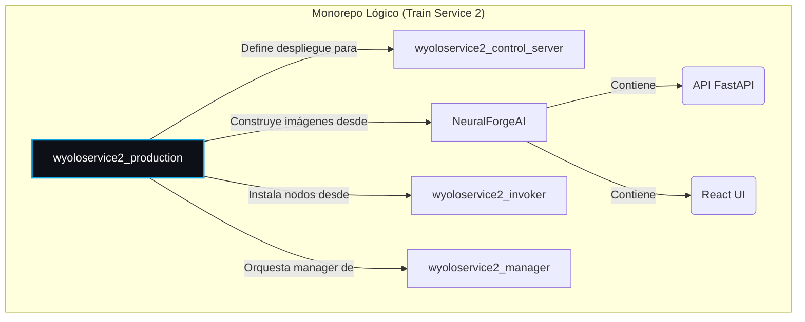
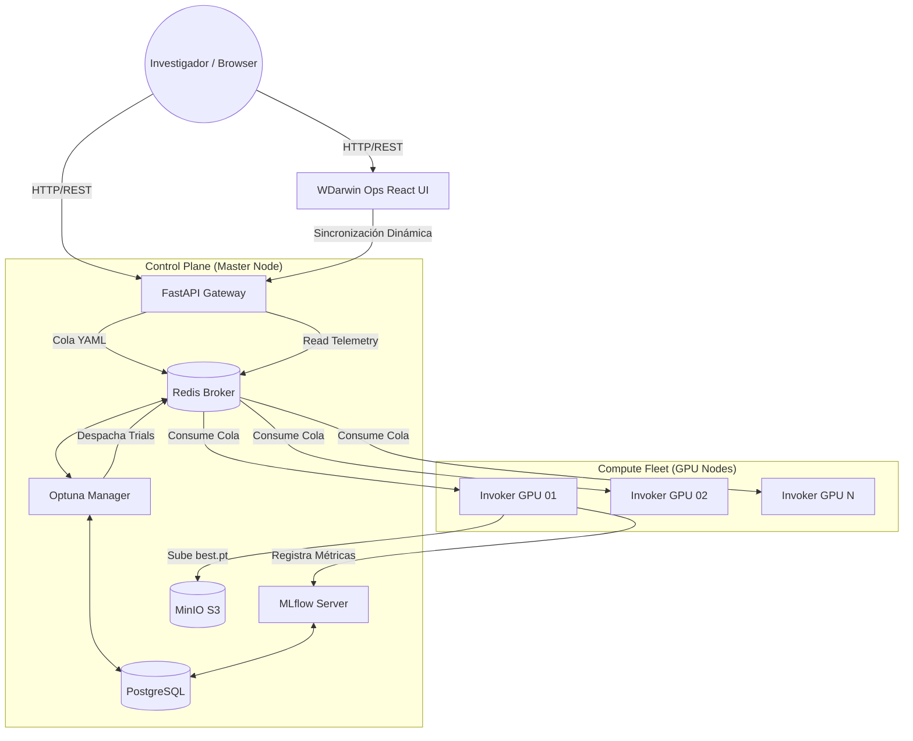
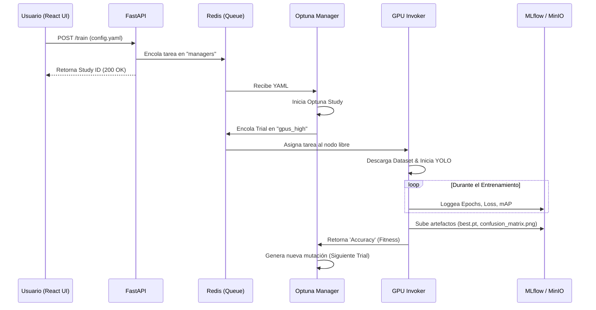

# 🧠 NeuralForgeAI & WDarwin Ops <br> <span style="font-size:0.6em; font-weight:normal;">Production Environment & Ecosystem Hub</span>


**NeuralForgeAI** (y su panel de control **WDarwin Ops**) es una plataforma de grado empresarial diseñada para la **orquestación distribuida, el entrenamiento escalable y la optimización evolutiva de hiperparámetros (Genetic Algorithms)** para arquitecturas avanzadas de visión artificial, específicamente **YOLOv8** y **YOLOv11**.

El objetivo central de este sistema es desacoplar la capa de interfaz de usuario de la capa de cómputo intensivo, permitiendo a investigadores y desarrolladores enviar configuraciones YAML simples hacia un clúster centralizado. El clúster se encarga de balancear la carga, asignar prioridades, evolucionar modelos y registrar todas las métricas sin intervención manual.

---

## 🛠️ Stack Tecnológico

El proyecto está construido sobre un stack moderno y de alto rendimiento:

### Frontend (UI)
*   **Core:** React 19, TypeScript
*   **Build System:** Vite, Node.js (18-alpine)
*   **Styling:** Tailwind CSS (v3.4, PostCSS nativo)
*   **Icons:** Lucide React

### Backend (API & Orchestration)
*   **API Gateway:** FastAPI, Python 3.10, Uvicorn (Endpoints RESTful)
*   **Task Queue:** Celery
*   **Hyperparameter Optimization:** Optuna (TPESampler, Genetic Algorithms)
*   **System Telemetry:** `psutil`

### Infraestructura y Datos
*   **Message Broker / State:** Redis
*   **Relational Database:** PostgreSQL (para estudios de Optuna)
*   **Artifacts Storage:** MinIO (compatible con S3)
*   **Experiment Tracking:** MLflow
*   **Deployment:** Docker Compose, Systemd (Watchdogs de resiliencia), Watchtower

---

## 🧩 Ecosistema de Microservicios

El sistema se compone de múltiples piezas especializadas que interactúan de forma asíncrona:

| Microservicio | Origen (Repo) | Descripción y Propósito |
| :--- | :--- | :--- |
| **Control Host (Infra)** | `wyoloservice2_control_server` | Levanta los cimientos de datos: Redis (colas), PostgreSQL (DB), MLflow (métricas) y MinIO (pesos). |
| **API Server** | `NeuralForgeAI/api` | Servidor FastAPI (`:23442`). Recibe los YAMLs, provee telemetría real del cluster y gestiona la persistencia de usuarios/proyectos en Redis. |
| **WDarwin Ops (UI)** | `NeuralForgeAI/UI` | Single Page Application en React (`:23432`). Panel de control global, dashboard de observabilidad, y gestión de identidad (Roaming Profile). |
| **Study Manager** | `wyoloservice2_manager` | Consumidor de Celery. Escucha la cola `managers`, recibe los estudios de Optuna, crea trials (mutaciones) y los envía a la cola de GPUs. |
| **Worker Invoker** | `wyoloservice2_invoker` | Nodo GPU de ejecución pesada. Toma tareas de las colas de prioridad (`gpus_high`, etc.), entrena YOLO y envía resultados a MLflow y MinIO. |
| **Gradio / Simple UI** | `wyoloservice2_manager/UI` | Interfaz alternativa (Fallback) levantada con Gradio para operaciones rápidas sin React. |

---

## 🗺️ Diagramas de Arquitectura

### 1. Relación de Repositorios (Codebase)



### 2. Arquitectura del Sistema (Hub and Spoke)



### 3. Flujo de Datos (Lanzamiento de Entrenamiento)



---

## 🚀 Despliegue en Producción

### Nodo de Control (Master)
Levanta la infraestructura base, la base de datos, la API y la interfaz React.

```bash
# 1. Levantar variables de entorno
cd wyoloservice2_production/control_server
make start_env

# 2. Levantar API y UI (Construidas nativamente)
make start_api

# 3. Levantar Optuna Manager
make start_manager
```

### Nodos GPU (Workers)
Cada máquina que tenga tarjetas gráficas debe registrarse en el clúster ejecutando el script de instalación automática (Watchdog).

```bash
cd wyoloservice2_production/workers
sudo chmod +x install.sh
sudo ./install.sh
```
*El script crea un demonio de `systemd` que garantiza que el worker se reinicie automáticamente ante fallos (indestructible) y configura `Watchtower` para descargar actualizaciones desde Docker Hub cada 10 minutos.*

---

## 👨‍💻 Autor

**William Steve Rodriguez Villamizar (wisrovi)**  
*AI Leader & Solutions Architect*  
[LinkedIn Profile](https://www.linkedin.com/in/wisrovi-rodriguez/)

> *"Bridging the gap between complex AI research and scalable industrial applications."*