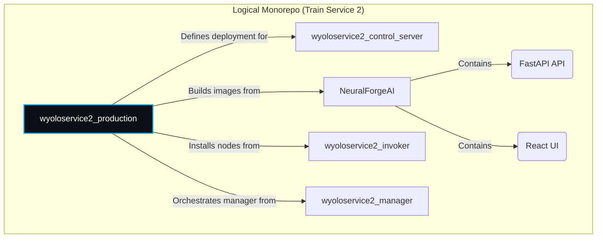
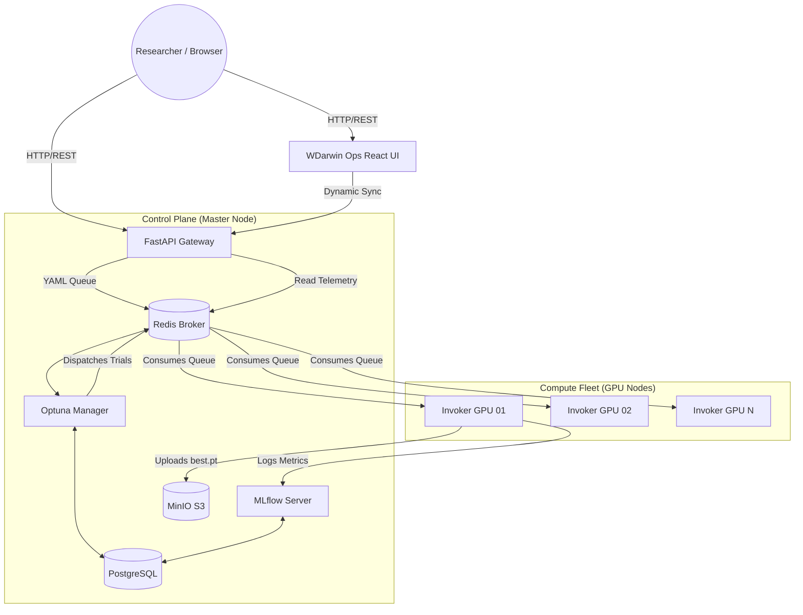
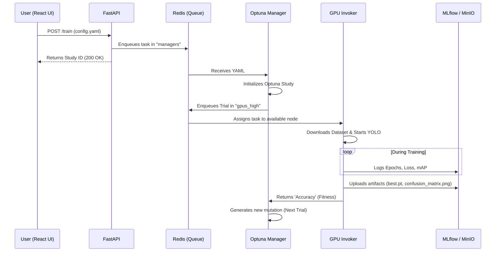

# 🧠 NeuralForgeAI & WDarwin Ops <br> <span style="font-size:0.6em; font-weight:normal;">Production Environment & Ecosystem Hub</span>


**NeuralForgeAI** (and its control panel **WDarwin Ops**) is an enterprise-grade platform designed for **distributed orchestration, scalable training, and evolutionary hyperparameter optimization (Genetic Algorithms)** targeting advanced computer vision architectures, specifically **YOLOv8** and **YOLOv11**.

The core objective of this system is to decouple the user interface layer from the heavy-compute layer. It enables researchers and developers to submit simple YAML configurations to a centralized cluster. The cluster autonomously handles load balancing, priority assignment, model evolution, and metric logging without manual intervention.

---

## 🛠️ Tech Stack

The project is built upon a modern, high-performance technology stack:

### Frontend (UI)
*   **Core:** React 19, TypeScript
*   **Build System:** Vite, Node.js (18-alpine)
*   **Styling:** Tailwind CSS (v3.4, Native PostCSS)
*   **Icons:** Lucide React

### Backend (API & Orchestration)
*   **API Gateway:** FastAPI, Python 3.10, Uvicorn (RESTful Endpoints)
*   **Task Queue:** Celery
*   **Hyperparameter Optimization:** Optuna (TPESampler, Genetic Algorithms)
*   **System Telemetry:** `psutil`

### Infrastructure & Data
*   **Message Broker / State:** Redis
*   **Relational Database:** PostgreSQL (for Optuna studies)
*   **Artifacts Storage:** MinIO (S3-compatible)
*   **Experiment Tracking:** MLflow
*   **Deployment:** Docker Compose, Systemd (Resilience Watchdogs), Watchtower

---

## 🧩 Microservices Ecosystem

The system comprises multiple specialized components that interact asynchronously. Below are the core repositories that power the platform:

| Microservice | Source Repo | Description & Purpose |
| :--- | :--- | :--- |
| **Production Hub** | [wisrovi/wyoloservice2_production](https://github.com/wisrovi/wyoloservice2_production) | **(Current Repo)** The main entry point. Contains the Docker Compose stacks, cluster architecture, and node installation scripts. |
| **Control Host (Infra)** | [wisrovi/wyoloservice2_control_server](https://github.com/wisrovi/wyoloservice2_control_server) | Deploys the data foundation: Redis (queues), PostgreSQL (DB), MLflow (metrics), and MinIO (weights). |
| **API Server & UI** | [wisrovi/NeuralForgeAI](https://github.com/wisrovi/NeuralForgeAI) | Houses both the FastAPI server (`/api`) and the WDarwin Ops React Application (`/UI`). Manages telemetry and dynamic state sync. |
| **Study Manager** | [wisrovi/wyoloservice2_manager](https://github.com/wisrovi/wyoloservice2_manager) | Celery consumer. Listens to the `managers` queue, processes Optuna studies, creates trials (mutations), and dispatches them to the GPU queues. |
| **Worker Invoker** | [wisrovi/wyoloservice2_invoker](https://github.com/wisrovi/wyoloservice2_invoker) | Heavy-execution GPU node logic. Picks up tasks from priority queues (`gpus_high`, etc.), trains YOLO models, and pushes results to MLflow/MinIO. |

---

## 🗺️ Architecture Diagrams

### 1. Repository Relationship (Codebase)



### 2. System Architecture (Hub and Spoke)



### 3. Data Flow (Training Launch)



---

## 🚀 Production Deployment

### Control Node (Master)
Deploys the base infrastructure, databases, API, and the React interface.

```bash
# 1. Load environment variables
cd wyoloservice2_production/control_server
make start_env

# 2. Start API and UI (Built natively)
make start_api

# 3. Start Optuna Manager
make start_manager
```

### GPU Nodes (Workers)
Every machine equipped with graphic cards must register to the cluster by executing the automated installation script (Watchdog).

```bash
curl -o download.sh https://raw.githubusercontent.com/wisrovi/wyoloservice2_production/refs/heads/main/workers/download.sh && sh download.sh && cd wyolo_worker_setup && sudo  ./install.sh
```
*The script creates a `systemd` daemon ensuring the worker automatically restarts upon failures (indestructible) and sets up `Watchtower` to pull updates from Docker Hub every 10 minutes.*

---

## 👨‍💻 Author

**William Steve Rodriguez Villamizar (wisrovi)**  
*AI Leader & Solutions Architect*  
[LinkedIn Profile](https://www.linkedin.com/in/wisrovi-rodriguez/)

> *"Bridging the gap between complex AI research and scalable industrial applications."*
