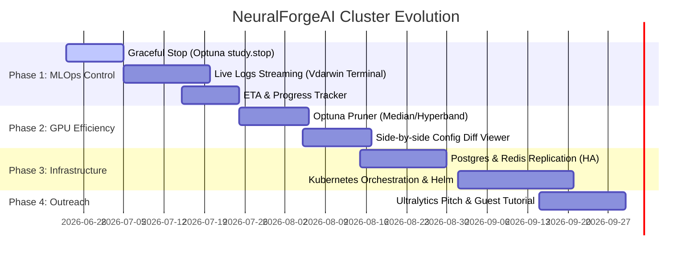

# 🧠 NeuralForgeAI & WDarwin Ops - Evolutionary Roadmap

This document outlines the strategic roadmap for the NeuralForgeAI training cluster and WDarwin Ops control panel. It details both application-level MLOps features and infrastructure-level scalability improvements.

---

## 📌 Table of Contents
*   [🗺️ GANNT Roadmap Timeline](#️-gannt-roadmap-timeline)
*   [🚀 Application & MLOps Feature Roadmap](#-application--mlops-feature-roadmap)
*   [☁️ Infrastructure & High-Availability Roadmap](#️-infrastructure--high-availability-roadmap)
*   [🤝 Partnership & Community Outreach Roadmap](#-partnership--community-outreach-roadmap)
*   [🧩 Sibling Repositories Roadmap & Upgrades](#-sibling-repositories-roadmap--upgrades)
*   [📜 Changelog & Release History](#-changelog--release-history)

---

## 🗺️ GANNT Roadmap Timeline

---

## 🚀 Application & MLOps Feature Roadmap

### 1. Graceful Study Cancellation (Optuna Graceful Stop)
* **Status:** `COMPLETED & IN PRODUCTION`
* **Objective:** Enable researchers to abort long-running sweeps safely without corrupting SQL databases or losing progress of completed trials.
* **Description:** Initiated from the WDarwin Ops UI via `POST /study/{study_id}/cancel`, the API Gateway sets a Redis cancellation flag. Active Celery GPU workers read this flag between epochs and trials, triggering `study.stop()` of Optuna to persist the best parameters found so far before exiting cleanly.

### 2. Live Training Logs Streaming (Terminal View)
* **Status:** `PLANNED`
* **Objective:** Monitor YOLO training progress and diagnose loss convergence issues in real time without SSH login to compute nodes.
* **Description:** GPU workers stream training stdout directly to a local `.log` file. The API exposes a websockets/SSE stream reading this log, allowing the WDarwin Ops frontend to display a terminal emulator logs viewport during training.

### 3. Study Completion ETA & Trials Tracker
* **Status:** `PLANNED`
* **Objective:** Provide visual estimates of the remaining time for complex, multi-trial hyperparameter searches.
* **Description:** The API calculates the average duration of completed trials for a running study. By multiplying this average by the remaining trials, it computes a dynamic ETA displayed as a progress bar on the UI.

### 4. Intelligent Trial Pruning (Optuna Pruners)
* **Status:** `PLANNED`
* **Objective:** Optimize GPU runtime by early-terminating trials that show poor convergence relative to historical averages.
* **Description:** Add support in the `base_config.yaml` to specify Optuna pruners (e.g., `MedianPruner`, `HyperbandPruner`). The worker will report epoch validation metrics to the database and prune trials that fall below the median threshold, saving massive compute hours.

### 5. Side-by-Side Configuration Diff Viewer
* **Status:** `PLANNED`
* **Objective:** Quickly pinpoint differences in search spaces, models, and training arguments across multiple studies.
* **Description:** Implement a comparative view on the UI where researchers can select two studies and view their parsed YAML configuration files side-by-side, highlighting discrepancies in continuous and discrete parameters.

---

## ☁️ Infrastructure & High-Availability Roadmap

### 1. High Availability (HA) Database & Broker Stack
* **Status:** `BACKLOG`
* **Objective:** Prevent single-point-of-failure (SPOF) outages for active clúster states and Celery queues.
* **Description:** 
  * Deploy PostgreSQL Master-Slave active replication to prevent trial metadata loss.
  * Configure Redis Sentinel to manage failover for Celery message queues automatically.

### 2. Kubernetes (K8s) Orchestration & Helm Charts
* **Status:** `BACKLOG`
* **Objective:** Simplify multi-node scaling and cluster deployments in production clouds.
* **Description:** Package all Master Node services into Helm Charts, allowing developers to spin up the entire API, Celery manager, MLflow, and Postgres stack on cloud Kubernetes engines (AWS EKS, GCP GKE) with a single command.

### 3. Terraform Infrastructure-As-Code (IaC)
* **Status:** `BACKLOG`
* **Objective:** Dynamically allocate and destroy GPU worker nodes based on queue load.
* **Description:** Write Terraform scripts to provision auto-scaling spot GPU instances on AWS or GCP when Celery high-priority queues are heavily loaded, reducing idle cloud costs.

---

## 🤝 Partnership & Community Outreach Roadmap

### 1. Ultralytics Ecosystem Integration & Marketing Pitch
* **Status:** `PLANNED`
* **Objective:** Leverage Ultralytics' massive audience (YOLO ecosystem) to boost downloads, usage, and developer reputation by featuring NeuralForge AI on their official channels.
* **Description:**
  * **Repository Polish:** Ensure all sub-repositories, docker-compose configuration hubs, and API interfaces are thoroughly documented in English with setup instructions and architecture charts.
  * **Interactive Demo:** Create a short high-fidelity video showcasing multi-node study scaling, priority queues in action, and live telemetry tracking on MLflow/Optuna.
  * **Value Pitch:** Approach Glenn Jocher (CEO) or DevRel leads with a clear value proposition: NeuralForge AI offers a free, open-source, decoupled Optuna-based distributed hyperparameter optimization cluster specifically for YOLO models.
  * **Guest Tutorial:** Contribute a detailed "How to scale YOLO training across GPU nodes" tutorial to the official Ultralytics documentation or blog.

---

## 🧩 Sibling Repositories Roadmap & Upgrades

To ensure complete architectural alignment, below is the roadmap and planned upgrades mapped for each sibling repository:

### 1. `wyoloservice2_production` (Production Hub)
*   **Upgrades:**
    *   Docker Compose multi-stage configurations for Development, Staging, and Production.
    *   Helm Charts and K8s configuration templates.
    *   Terraform scripts for dynamic GPU compute fleet auto-scaling.

### 2. `wyoloservice2_control_server` (Control Server)
*   **Upgrades:**
    *   PostgreSQL Master-Slave active replication setup.
    *   Redis Sentinel cluster configuration for HA Celery broker failover.
    *   MinIO S3 bucket data retention and automated pruning lifecycle rules (removing old trials weights).

### 3. `NeuralForgeAI` (FastAPI API & React UI)
*   **Upgrades:**
    *   SSE (Server-Sent Events) or Websockets endpoint to stream stdout training logs.
    *   Interactive terminal logs UI component in the training details panel.
    *   ETA progress bar logic and side-by-side YAML configuration comparator.

### 4. `wyoloservice2_manager` (Study Manager)
*   **Upgrades:**
    *   Graceful cancel monitoring loop checking Redis flags.
    *   Integration of dynamic pruners and mapping intermediate trial metrics to database.
    *   Optimization results notification dispatcher (Email / Slack alerts on study completion).

### 5. `wyoloservice2_invoker` (Worker Invoker)
*   **Upgrades:**
    *   Detailed host telemetry (e.g. network utilization, S3 upload speeds, filesystem disk I/O).
    *   Sub-process GPU container management to deploy tasks on specific CUDA devices dynamically.
    *   Automatic image pruning of old `worker_executor` versions on the host.

### 6. `wyoloservice2_worker` (YOLO Training Worker)
*   **Upgrades:**
    *   Support for YOLOv12 and newer Vision Transformer architectures.
    *   Local DVC SSD caching to skip downloading duplicate datasets over Samba for consecutive trials.
    *   Automated S3 checkpointing to resume training trials interrupted by host hardware failures.

### 7. `wyoloservice2_mcp` (Model Context Protocol)
*   **Upgrades:**
    *   Additional tools for system administration: `restart_service(service_name)`, `get_gpu_temp()`, and `view_failed_trial_traceback(trial_id)`.
    *   Enhanced natural language prompt instructions for autonomous agent pair-programming.

---

## 📜 Changelog & Release History

### Version 2.0.0 (Current Release) - 2026-07-03
*   **Decoupled Distributed Architecture:** Migrated from single-host execution script model (v1.0) to Celery dynamic message queue worker-invoker topologies.
*   **Genetic Hyperparameter Tuning:** Optuna framework integration mapping trials, studies, and samplers (TPESampler/RandomSampler) to PostgreSQL database.
*   **Model Context Protocol (MCP) Integration:** Exposed `wyoloservice-mcp` stdio FastMCP server to allow LLMs to validate datasets, generate configs, and monitor active training runs.
*   **Fuzzy Metrics Extraction Fallback:** Implemented automatic regex fallback matching to translate standard YOLO outputs (e.g. `metrics/mAP50`) to task-specific labels (e.g. `metrics/mAP50(B)` or `metrics/mAP50(M)`).
*   **Host mount write protections:** Automated Touch test validation at system startup on workers to preempt write permissions failures on Samba mounts.
*   **Advanced E2E UI Smoke Tests:** Integrated basic Activity-based dry-runs and advanced E2E Flame-based YOLO26 trainings on UI.

### Version 1.1.0 - 2026-05-15
*   **FastAPI & UI Decoupling:** Separated backend endpoints from Vite/React frontend dashboard.
*   **MLflow Real-time Tracking:** Streamed epoch statistics and validation metrics directly to MLflow.
*   **MinIO S3 storage:** Replaced host directory local saves with S3-compatible bucket artifact uploads.

### Version 1.0.0 (Initial Release) - 2026-02-10
*   Ephemeral Docker container executor for YOLOv8 classification training.
*   Local filesystem `/app/data/` for configuration YAML and output checkpoints.
