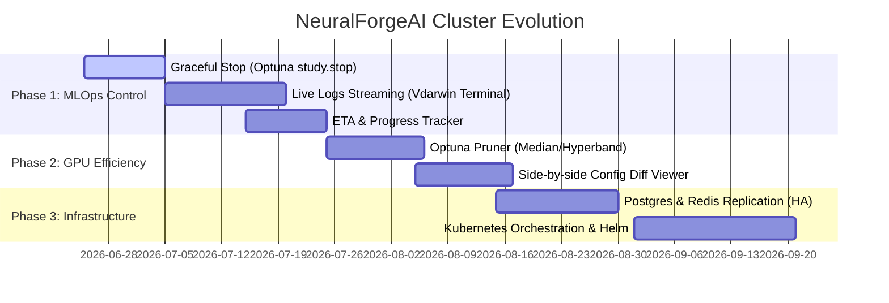

# 🧠 NeuralForgeAI & WDarwin Ops - Evolutionary Roadmap

This document outlines the strategic roadmap for the NeuralForgeAI training cluster and WDarwin Ops control panel. It details both application-level MLOps features and infrastructure-level scalability improvements.

---

## 🗺️ GANNT Roadmap Timeline

---

## 🚀 Application & MLOps Feature Roadmap

### 1. Graceful Study Cancellation (Optuna Graceful Stop)
* **Status:** `COMPLETED & IN PRODUCTION`
* **Objective:** Enable researchers to abort long-running sweeps safely without corrupting SQL databases or losing progress of completed trials.
* **Description:** Initiated from the WDarwin Ops UI via `POST /study/{study_id}/cancel`, the API Gateway sets a Redis cancellation flag. Active Celery GPU workers read this flag between epochs and trials, triggering `study.stop()` of Optuna to persist the best parameters found so far before exiting cleanly.

### 2. Live Training Logs Streaming (Terminal View)
* **Status:** `PLANNED`
* **Objective:** Monitor YOLO training progress and diagnose loss convergence issues in real time without SSH login to compute nodes.
* **Description:** GPU workers stream training stdout directly to a local `.log` file. The API exposes a websockets/SSE stream reading this log, allowing the WDarwin Ops frontend to display a terminal emulator logs viewport during training.

### 3. Study Completion ETA & Trials Tracker
* **Status:** `PLANNED`
* **Objective:** Provide visual estimates of the remaining time for complex, multi-trial hyperparameter searches.
* **Description:** The API calculates the average duration of completed trials for a running study. By multiplying this average by the remaining trials, it computes a dynamic ETA displayed as a progress bar on the UI.

### 4. Intelligent Trial Pruning (Optuna Pruners)
* **Status:** `PLANNED`
* **Objective:** Optimize GPU runtime by early-terminating trials that show poor convergence relative to historical averages.
* **Description:** Add support in the `base_config.yaml` to specify Optuna pruners (e.g., `MedianPruner`, `HyperbandPruner`). The worker will report epoch validation metrics to the database and prune trials that fall below the median threshold, saving massive compute hours.

### 5. Side-by-Side Configuration Diff Viewer
* **Status:** `PLANNED`
* **Objective:** Quickly pinpoint differences in search spaces, models, and training arguments across multiple studies.
* **Description:** Implement a comparative view on the UI where researchers can select two studies and view their parsed YAML configuration files side-by-side, highlighting discrepancies in continuous and discrete parameters.

---

## ☁️ Infrastructure & High-Availability Roadmap

### 1. High Availability (HA) Database & Broker Stack
* **Status:** `BACKLOG`
* **Objective:** Prevent single-point-of-failure (SPOF) outages for active clúster states and Celery queues.
* **Description:** 
  * Deploy PostgreSQL Master-Slave active replication to prevent trial metadata loss.
  * Configure Redis Sentinel to manage failover for Celery message queues automatically.

### 2. Kubernetes (K8s) Orchestration & Helm Charts
* **Status:** `BACKLOG`
* **Objective:** Simplify multi-node scaling and cluster deployments in production clouds.
* **Description:** Package all Master Node services into Helm Charts, allowing developers to spin up the entire API, Celery manager, MLflow, and Postgres stack on cloud Kubernetes engines (AWS EKS, GCP GKE) with a single command.

### 3. Terraform Infrastructure-As-Code (IaC)
* **Status:** `BACKLOG`
* **Objective:** Dynamically allocate and destroy GPU worker nodes based on queue load.
* **Description:** Write Terraform scripts to provision auto-scaling spot GPU instances on AWS or GCP when Celery high-priority queues are heavily loaded, reducing idle cloud costs.
