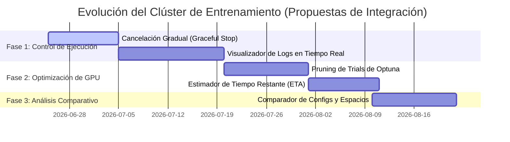

# Propuesta de Roadmap y Mejoras del Sistema

A partir del análisis del ecosistema actual de **NeuralForgeAI** y considerando las necesidades específicas del proyecto (creación manual de workers, integración con DVC y MLflow, y aplazamiento de autenticación JWT), se proponen las siguientes 5 mejoras clave:

---

## 🗺️ Mapa de Ruta del Sistema (Roadmap)

---

## 🚀 Las 5 Propuestas Detalladas de Mejora

### 1. Cancelación Gradual de Estudios (Graceful Stopping)
* **Objetivo:** Permitir abortar estudios de forma segura sin corromper bases de datos o interrumpir abruptamente escrituras de archivos.
* **Descripción:** Implementar un botón de *"Detener con seguridad"* en el frontend de React. Al pulsarlo, el backend de FastAPI registrará una bandera de parada en Redis (`study:{study_id}:cancel = 1`). En [worker_gpu.py](file:///home/wisrovi/Documents/train_service_2/wyoloservice2_invoker/app/worker_gpu.py), dentro del bucle de trials de Optuna, se consultará esta bandera al finalizar cada época o trial. Si está activa, se invocará `study.stop()` de Optuna, asegurando que el estudio guarde y reporte los mejores hiperparámetros encontrados hasta ese momento y cierre el proceso de forma limpia.

---

### 2. Visualizador de Logs de Entrenamiento en Vivo (Streaming de Stdout)
* **Objetivo:** Monitorear el progreso y diagnosticar fallas de entrenamiento sin necesidad de conectarse por SSH al worker para ver la salida de terminal.
* **Descripción:** El worker redirigirá la salida del comando de entrenamiento de YOLO a un archivo `.log` local asociado a la tarea. Se creará un endpoint en la API que lea este archivo y lo exponga al cliente. El frontend en [LaunchTrainingView.tsx](file:///home/wisrovi/Documents/train_service_2/NeuralForgeAI/UI/components/LaunchTrainingView.tsx) incorporará un visor interactivo de terminal para visualizar estas líneas de log en tiempo real mientras el modelo entrena.

---

### 3. Estimación del Tiempo Restante (ETA) para Estudios de Optimización
* **Objetivo:** Brindar visibilidad del progreso temporal de los estudios hiperparamétricos de larga duración.
* **Descripción:** Modificar el cálculo de estado en [api/main.py](file:///home/wisrovi/Documents/train_service_2/NeuralForgeAI/api/main.py#L139) para registrar el tiempo promedio transcurrido por trial completado de un `study_id`. Multiplicando este promedio por los trials restantes (`n_trials` definido en la configuración menos los trials ya ejecutados), el sistema estimará un ETA de finalización que se mostrará como una barra de progreso en la UI.

---

### 4. Soporte para Pruning Inteligente de Trials (Poda de Optuna)
* **Objetivo:** Optimizar el uso de las GPUs cancelando tempranamente aquellos trials que no muestran potencial de mejora.
* **Descripción:** Introducir soporte en el esquema YAML para configurar pruners de Optuna (ej. `MedianPruner` o `HyperbandPruner`) bajo el bloque `sweeper`. En el worker, si el pruner está configurado, la función de optimización de Optuna reportará métricas intermedias y detendrá de manera automática el trial actual a mitad de camino si el rendimiento está por debajo de la mediana del histórico del estudio, ahorrando horas de GPU en trials inviables.

---

### 5. Comparador Visual de Configuraciones y Espacios de Búsqueda
* **Objetivo:** Analizar rápidamente las diferencias en hiperparámetros y configuraciones entre distintos estudios que se comparan en MLflow.
* **Descripción:** Dado que el historial de configuraciones YAML/JSON queda registrado en Redis por `study_id`, se añadirá una pestaña de comparación en la UI de React. El usuario seleccionará dos estudios del histórico y la UI mostrará un visor de diferencias lado a lado (Side-by-side Diff Viewer) resaltando las discrepancias en el modelo, épocas, datasets o el espacio de búsqueda hiperparamétrica configurado.
