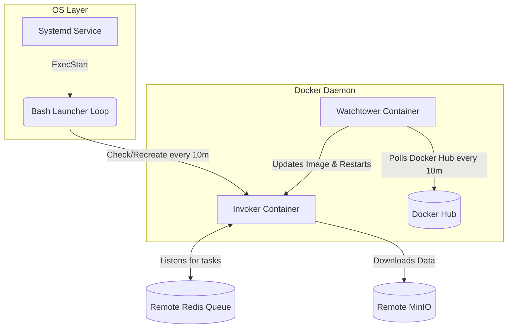

# ⚙️ Worker Invoker Node <br> <span style="font-size:0.6em; font-weight:normal;">Automated Installation & Resilience Engine</span>


This directory contains the deployment logic and lifecycle management tools for the **Worker Invoker** (also related to the Executor layer). These scripts transform any raw Linux machine equipped with NVIDIA GPUs into an indestructible, auto-updating compute node integrated seamlessly into the **NeuralForgeAI** cluster.

The Worker Invoker is the "muscle" of the operation. It listens to the Celery priority queues (managed by the Master Node), downloads datasets, executes heavy YOLO trainings, and uploads the resulting artifacts (weights, metrics, confusion matrices) back to the centralized MLflow and MinIO instances.

---

## 🏗️ Directory Architecture

To keep the installation clean and modular, the configuration files are logically separated:

*   **`/docker/`**: Contains the Docker Compose definitions and environment variable templates required to run the Invoker containers and Watchtower.
*   **`/os/`**: Contains the native Linux integration scripts (Systemd service units and Bash watchdogs) that ensure the container stays alive at the OS level.
*   **`install.sh`**: The master deployment script that binds everything together.
*   **`uninstall.sh`**: Safely removes the service, stops containers, and cleans up the system.

---

## 🛡️ Resilience & Auto-Healing Mechanisms

We have engineered this node to operate with zero human intervention once deployed:

### 1. The Bash Watchdog (Systemd)
Instead of relying solely on Docker's `--restart always`, we deploy a custom `systemd` service (`worker_invoker@.service`). This service runs a lightweight, infinite Bash loop (`launcher_invoker.sh`) that polls the Docker engine every **10 minutes**. 
*   If an administrator or a rogue process accidentally deletes or forcefully stops the Invoker container (`docker rm -f`), the Watchdog will detect the absence and autonomously re-create the container with its full original configuration.

### 2. Watchtower (Auto-Updater)
Running alongside the Invoker is a highly configured Watchtower container. Every **10 minutes**, it silently queries Docker Hub. 
*   If a new version of the Worker image (`wisrovi/train_service:worker_invoker_v1.0.0`) is pushed, Watchtower gracefully stops the current training (if safe), pulls the new layer, and spins up the new container automatically.

> [!IMPORTANT]
> The physical Docker Hub image tag must ALWAYS be strictly kept as **`wisrovi/train_service:worker_invoker_v1.0.0`** to allow **Watchtower** to trigger updates on all 70+ node installations. Software releases and logical versioning (e.g. current release **`v1.3.3`**) are updated internally within the image, but published under the same physical tag.

---

## 🗺️ Node Lifecycle & Resilience Flow



---

## 🚀 Installation Guide

### Prerequisites
1.  A Linux machine (Ubuntu/Debian recommended).
2.  **NVIDIA Drivers** and **NVIDIA Container Toolkit** installed.
3.  Docker and Docker Compose installed.
4.  Network visibility to the Master Node (Control Server).

### Deployment Steps

1.  **Configure the Master Node IP:**
    Edit the `docker/control_host.env` file (or provide one in the root `workers/` directory) and set the `CONTROL_HOST` variable to match the IP of your master server.
    ```env
    CONTROL_HOST=192.168.10.252
    ```

2.  **Run the Installer:**
    Execute the script with `sudo`. It will auto-detect your Hardware (RAM, CPU Cores, NVIDIA GPU model), generate the necessary metadata, and register the service.
    ```bash
    sudo chmod +x install.sh
    sudo ./install.sh
    ```

3.  **Verify the Installation:**
    Check that the systemd service is active and the Watchdog is running:
    ```bash
    systemctl status worker_invoker@$(hostname -I | awk '{print $1}')
    docker ps | grep wyolo_invoker
    ```

### Uninstallation
If you need to permanently remove this machine from the GPU cluster:
```bash
sudo ./uninstall.sh
```

---

## 🔄 Interaction with the Executor
The **Invoker** acts as the primary listener on the Celery queues (`gpus_high`, `gpus_medium`, `gpus_low`). When a task is picked up, the Invoker utilizes the underlying **Executor** logic to parse the YAML configuration, bridge the connection to Optuna, and launch the localized YOLO training subroutine.

---

## 👨‍💻 Author
**William Steve Rodriguez Villamizar (wisrovi)**  
*AI Leader & Solutions Architect*